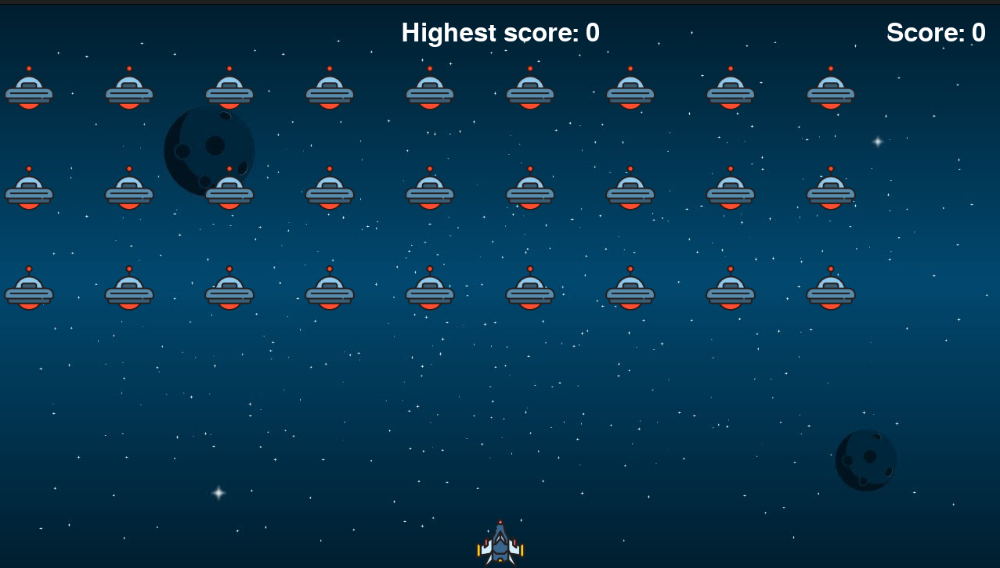

# Alien Invasion Project

This project is based on the "Alien Invasion" project from the book "Python Crash Course" by Eric Matthes. It's a simple game where the player controls a spaceship and shoots aliens.



## Learning Journey

As a beginner in the world of programming, I embarked on this project as part of my exploration into the fundamentals of Python. The book played a pivotal role in my learning experience, providing clear explanations, hands-on exercises, and practical projects like this one.

## Getting Started

These instructions will help you get a copy of the project up and running on your local machine for development and testing purposes.

### Prerequisites

- Python 3.x
- Pygame library (install using `pip install pygame`)

### Installing

1. Clone the repository:

   ```bash
   git clone https://github.com/your-username/alien-invasion.git
   ```

2. Navigate to the project directory:

   ```bash
   cd alien-invasion
   ```

3. Run the game:

   ```bash
   python alien_invasion.py
   ```

## Controls

- **Left Arrow Key:** Move the spaceship to the left.
- **Right Arrow Key:** Move the spaceship to the right.
- **Space Key:** Shoot lasers to destroy aliens.

Feel free to customize and modify the game to enhance your Python programming skills. Have fun playing and coding!

